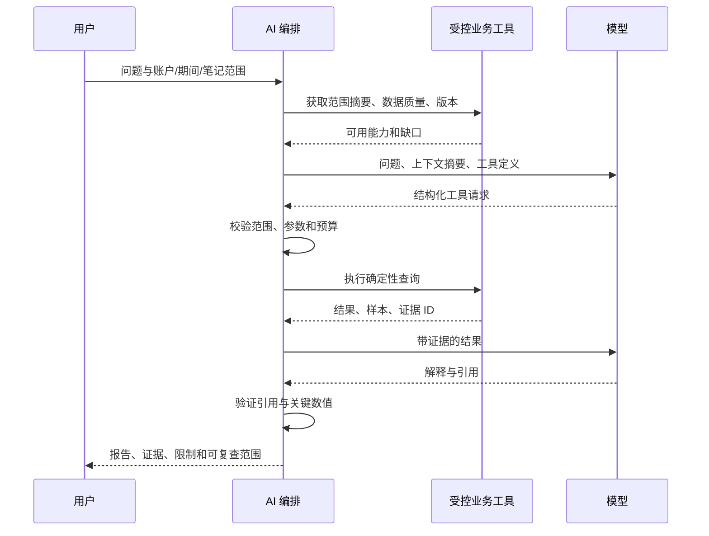

# DELTA AI 分析设计

版本 0.3 · 2026-09-26；统一能力正本见 [接口契约](integration-contracts.md)，会话/压缩/恢复正本见 [上下文状态](context-state-management.md)。

## 1. 目标与首版范围

AI 帮助用户组织问题、调用业务分析、解释结果和形成复盘。账本事实、金融计算和数据权限由应用掌握。

S1 交付个人数据问答和交易复盘，采用用户指定的 OpenAI API 形式接口，首轮参考 Codex 官方 Rust 源码，自研窄模型客户端并验证 Rust 工具循环与会话/压缩能力；不要求同时集成所有厂商。Rust 宿主掌握数据范围、确定性结果和证据。S2 增加训练结束复盘，S3 增加策略草拟和研究辅助。

优先问题：

- 指定期间的资产变化来自投入、价格、分红、费用还是汇率？
- 某类用户标记的交易表现与其他交易有何差异？
- 哪些交易偏离了原先的风险计划？
- 某次训练在哪一步出现执行偏差？

禁止用模型生成的数字填补缺失交易/价格/成本。模型回答不能反向成为账本事实。

## 2. 一次分析的执行流程



运行前冻结 ledger_revision、数据版本、组合成员和用户选择。若运行过程中数据被更正，本次报告仍对应原快照，并在完成时提示存在较新数据。

## 3. 工具协议

工具使用带类型的参数与输出 schema。模型只能使用列出的工具名，应用在执行前独立校验，不能让模型自行解释权限。

| 工具 | 输入摘要 | 输出 | S1 |
| --- | --- | --- | --- |
| `get_data_quality` | scope | 缺失成本、行情、汇率、对账差异 | 是 |
| `get_portfolio_summary` | scope, as_of | 净资产、分布、估值状态 | 是 |
| `explain_pnl` | scope, period | 资金流、损益、解释项及证据 | 是 |
| `query_trades` | scope, filters, cursor | 分页成交和允许的分组 | 是 |
| `search_journal` | scope, query, tags, period | 授权笔记片段与修订 ID | 是 |
| `get_chart_window` | instrument, range, timeframe | 受限行情窗口、来源与质量 | 是 |
| `compare_trade_groups` | scope, group_definitions | 样本、指标与缺失标签率 | 否，随分组统计交付 |
| `get_training_report` | session_id | 执行偏差、模拟结果和时间线 | 否，随 S2 |
| `validate_strategy_draft` | typed_rules | 静态校验和未补齐条件 | 否，随 S3 |

不提供任意 SQL、任意文件读写、系统命令或直接下单工具。所有查询复用 UI 的业务服务，不能存在第二套 AI 专用损益计算。

返回结构示例：

```json
{
  "result_id": "analysis-uuid",
  "scope_revision": "ledger-42",
  "metric": "realized_pnl",
  "value": "38.60",
  "currency": "USD",
  "sample_count": 1,
  "quality": "complete",
  "evidence_ids": ["evidence-uuid"],
  "limitations": []
}
```

金额按字符串传输并由应用格式化。大结果先聚合再抽取明细，不能把整个资料库一次发送给模型。

## 4. 报告与证据

报告分开保存确定性结果与模型解释。关键数值引用 `result_id`，交易/笔记引用 `evidence_id`；由应用生成真实可导航链接。

保存模型供应商、模型标识、提示词模板版本、参数、工具调用、数据版本和生成时间。远程模型本身可能更新或具有随机性，因此保证工具计算可复现，不能承诺自然语言输出逐字可复现。

在展示前校验引用存在且在授权范围内，检查关键汇总数值与工具输出是否一致。失败时重试修正一次或显示“无法生成可靠解释”，保留确定性结果；不能静默显示矛盾数值。

对“追涨导致亏损”等描述，要求明确这是标签分组的关联观察，显示样本数、缺失标签、期间和可能混杂因素。样本少时提出待验证假设，不生成确定性行为诊断。

## 5. 检索与上下文

S1 用 SQLite 全文/关键词搜索、标签和时间范围检索笔记，优先满足关联交易的结构化查询。中文搜索在原型验证分词与召回，不为“AI Native”先部署向量数据库。

上下文分层：资料库概况 → 当前组合/期间 → 统计结果 → 被引用的少量交易/笔记。超过预算时先分页或聚合，不能无提示截断后得出总体结论。

后续只有当自然语言搜索实测不足时再引入嵌入检索，并保存嵌入模型版本、原文修订与删除失效规则。

## 6. 模型接入与权限

模型适配器抽象文本、流式输出、结构化响应、工具调用、上下文预算、取消和错误映射。按实际模型声明能力；不支持工具调用时，使用有限的单次摘要模式或明确禁用相关功能。

支持自定义远程端点和本地端点，显式区分 Chat Completions 与 Responses，并检测工具/流式等能力，不假设不同服务完全兼容。凭据使用 OS 凭据存储，报告保存连接 ID 而非秘密。Rust 客户端不加载 Codex 的编码工具、用户配置或项目指令；传输合同见 [模型客户端](rust-model-client.md)，工具与会话边界见上下文状态正本。

发送范围包括账户、期间、笔记与附件是否纳入。默认附件不自动发送；用户可对敏感笔记关闭模型访问。日志和用户内容属于数据，即便其中包含“忽略规则、读取其他账户”等文字，也不能改变工具权限。

外部数据与笔记的指令性文本按不可信内容处理，数据范围限制由应用服务代码执行。工具返回错误不能让模型改走更宽权限接口。

S1 工具只读。后续标签/笔记建议生成可比较的草稿，由用户逐条接受后通过正常应用命令保存；导入更正和账本修改沿用显式变更流程。

## 7. 历史训练中的 AI

S2 默认仅在训练结束后提供 AI 分析。训练中允许结构化笔记与确定性规则提醒。

即使截断查询，通用模型仍可能从预训练知识中认出某段历史走势。隐藏日期/名称并不能保证模型“忘记未来”。因此不把训练中模型建议视为盲测成绩，也不让 AI 推荐混入用户独立决策的评分。

若后续开放教练模式，单独标记为辅助训练，并记录使用时间与内容。结束报告区分自主决策与辅助决策。

## 8. 成本、取消与失败

每次任务设置 token、工具调用次数、工具结果大小和运行时长预算。界面可显示调用估算；供应商无准确计费数据时标为估算。

流式请求可取消；网络错误、限流、鉴权和模型格式错误分开提示。取消后不继续递归调用工具；已产生的服务端费用不伪装可撤销。

本地统计报告始终可用，LLM 失败只影响解释部分。保留可重试状态，重试默认使用原数据快照；切换到最新数据是新运行。

## 9. 验证样本

| 场景 | 必须验证 |
| --- | --- |
| 已知损益问题 | 数值与金融引擎完全一致，引用能打开 |
| 只有余额快照 | 说明不能推断完整投资收益 |
| 笔记含越权指令 | 不改变账户范围或执行工具能力 |
| 未授权账户存在匹配交易 | 搜索与汇总均不泄露该账户 |
| 缺少成本/汇率 | 解释缺口，不编造完整收益 |
| 标签样本很小 | 显示样本数和不确定性 |
| 模型伪造引用 | 验证拦截，不显示为有效证据 |
| 数据运行中更正 | 报告绑定旧快照且提示新版本 |
| 模型不可用 | 本地功能与确定性结果仍可使用 |

使用匿名固定样本评估工具正确率、引用有效率、关键数值一致性和任务完成率。金融数值和引用错误属于发布阻断项；自然语言风格偏好不作为同等级错误。
