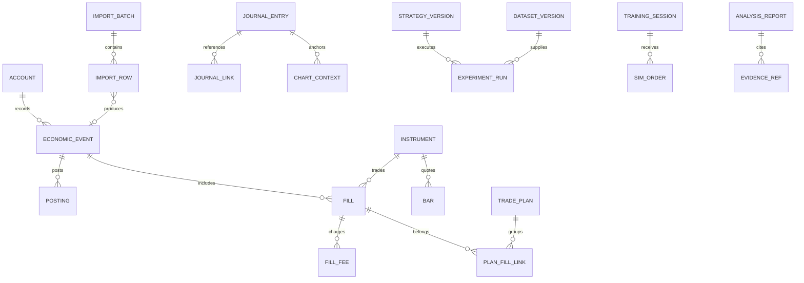

# DELTA 数据模型设计

版本 0.2 · 2026-09-26 · 逻辑模型，尚非数据库迁移脚本；AI 会话所有权见 [上下文状态](context-state-management.md)。

## 1. 通用规则

- 内部实体使用稳定 UUID；展示代码不作为主键。`AAPL` 之类符号需要交易场所和有效期映射。
- 时间统一持久化为 UTC 时间戳，并保存来源时区、交易日期和原始精度。区间约定为 `[start, end)`。
- 金额、价格、数量、费率采用有明确精度的十进制值。SQLite 中保存规范化十进制 TEXT，金融聚合在 Rust Decimal 中执行，禁止依赖 SQLite 隐式 REAL 转换求和。排序和过滤使用受控解析或验证后的辅助索引。
- Rust Decimal 的范围有限；标的精度和数值超出支持范围时拒绝并给出原因，不能静默截断。任意链上代币精度不作为首版承诺。
- 所有派生数据带计算版本与源修订号；所有外部数据带来源、获取时间和质量状态。
- 账户拥有的资产/币种与可交易合约分开建模：USD、USDT、USDC 独立；BTC 资产与某交易所 BTC/USDT 交易对独立。

## 2. 实体关系

图为核心关联示意；复杂关系和约束以以下表为准。

## 3. 账户、资产与范围

| 实体 | 关键字段 | 约束与含义 |
| --- | --- | --- |
| library | id, schema_version, book_currency, created_at | 记账本位币建立后固定；报表币种另设 |
| account | id, name, type, provider, external_ref, status | 真实账户实体；账户号展示脱敏 |
| portfolio / portfolio_member | id, name / portfolio_id, account_id, valid_from, valid_to | 组合内成员唯一；历史成员范围可版本化 |
| asset | id, kind, symbol, network, contract_address, precision | 法币、股票权益、加密资产等稳定身份 |
| instrument | id, kind, venue, base_asset_id, quote_asset_id, lot_size, tick_size, multiplier | 可交易标的；现货 multiplier=1 |
| instrument_alias | provider, external_symbol, instrument_id, valid_from, valid_to | 保留更名和来源映射，不按符号直接合并 |
| manual_valuation | asset_or_liability_id, account_id, value, currency, as_of, method | 其他资产和负债估值；负债符号统一处理 |
| provider_connection | id, provider, credential_ref, capabilities, status | 不保存明文秘密 |

报告必须保存账户成员快照，避免后来修改组合成员改变旧报告含义。负债在领域模型中有明确类型，禁止用户通过随意填写负资产来规避校验。

## 4. 导入与同步

| 实体 | 关键字段 | 约束与含义 |
| --- | --- | --- |
| import_batch | id, account_id, source, file_hash, mapping_version, status, counts, created_at | 同账户同文件默认幂等；重新映射走显式修订流程 |
| import_row | id, batch_id, row_no, raw_payload, normalized_payload, validation_state, event_id | 保留错误/排除原因；原始内容仅本地存储 |
| source_record | provider, account_id, record_type, external_id, revision, payload_hash | 有来源 ID 时以来源业务主键和修订号去重 |
| sync_checkpoint | connection_id, resource, cursor, last_committed_at | 与该页记录在同一事务提交 |
| balance_snapshot | account_id, asset_id, quantity, as_of, source | 对账用，不能覆盖账本 |
| reconciliation_issue | account_id, as_of, expected, observed, reason, resolution_event_id | 未解决差异对报告质量可见 |

无可靠来源 ID 时，同文件按文件哈希与行号识别。来源标识按账户唯一：同一账户再次出现同一 `source_ref` 视为已导入并自动跳过；另一账户可以写入同一来源标识。同一时间、数量、价格和费用的两笔真实成交可能都有效，因此跨文件内容指纹只生成疑似重复，不自动丢弃。用户确认接受时以该行自己的来源标识写入，不并入先前来源。

连接器同时返回成交、资金流水和费用时，需按经济事件关联，防止同一笔交易的扣款被再次当作独立买入或出金。

## 5. 账本与成交

采用“不可变业务事件＋平衡分录＋可重建投影”。用户仍以买入、转账等业务操作输入。

| 实体 | 关键字段 | 约束与含义 |
| --- | --- | --- |
| economic_event | id, type, occurred_at, recorded_at, source_ref, correction_group_id, revision | 一个业务事实；时间相同按稳定序号排序 |
| journal_transaction | id, event_id, book_currency, posting_rule_version, reversal_of | 一笔平衡记账事务 |
| ledger_account | id, owner_account_id, category, asset_id | 现金、持仓成本、收入、权益、负债、清算等分类 |
| posting | transaction_id, ledger_account_id, native_asset_id, native_quantity, book_amount | book_amount 为有符号本位币金额，事务合计精确为零 |
| fill | id, event_id, instrument_id, side, quantity, price, quote_currency, occurred_at | 数量为正，方向单独表示；可有多个费用 |
| fill_fee | fill_id, amount, currency, category, source_ref | 币种必须明确；可以含返佣，符号和类型显式规定 |
| transfer_group | id, outbound_event_id, inbound_event_id, principal_quantity, fee_event_id, state | principal 与费用分开；未配对进入待核对 |
| cost_lot / lot_allocation | source_fill_id, remaining_quantity, remaining_cost / sell_fill_id, lot_id, quantity, cost | 派生，按指定成本算法版本重建 |
| holding_projection | account_id, asset_id, quantity, carrying_cost, ledger_revision | 缓存，不是资金事实来源 |

记账平衡在同一个资料库固定的记账本位币中检查；不能把 BTC 数量与 USD 数量直接相加。原币数量也要按事件规则守恒，例如转账本金、成交数量和费用扣款。估值属于分析投影，不能用市场价格变化直接篡改历史成本分录。

本位币折算不足时事件先进入待入账区；不能用零汇率正式入账。报表币种可以改变，并引用独立的汇率集重新计算展示。多币种现金也可能产生汇兑损益，不能仅处理股票价格变化。

已入账错误使用冲销与替代事件，一次事务完成。账本投影消费冲销分录；成本批次投影消费同一 correction_group 中的有效成交修订，避免把“冲销成交”和“删除旧成交”重复应用。两种投影必须在同一修订号完成校验。

历史记录因可追溯要求不做日常物理删除；用户删除资料库或明确执行数据删除流程属于单独操作，覆盖原始导入和附件的引用处理。

## 6. 行情、日历与数据版本

| 实体 | 关键字段 | 约束与含义 |
| --- | --- | --- |
| bar | instrument_id, timeframe, session, open_at, close_at, OHLCV, source, adjustment, is_final, dataset_version | 唯一键覆盖来源/场所/周期/时段/复权/版本 |
| corporate_action | instrument_id, action_type, ex_date, pay_date, ratio_or_amount, announced_at, source | 记录时间与生效时间分开 |
| fx_rate | base_currency, quote_currency, rate, effective_at, observed_at, source, dataset_version | 明确方向：1 base 等于 rate quote |
| calendar_session | venue, session_date, timezone, open_at, close_at, kind, version | 假期、半日市、夏令时；不把 weekday 当完整日历 |
| dataset_version | id, manifest_hash, source, acquired_at, coverage, quality, temporal_quality | manifest 指向不可变内容；记录是否支持历史可得性 |
| dataset_partition | version_id, instrument_range, time_range, location, checksum | M1 可指 SQLite 快照，后续指 Parquet |
| coverage_gap | dataset_version, instrument_id, range, gap_kind, resolution | 区分休市、无成交、供应商缺失和未知 |

`effective_at` 表示事实对应时刻，`observed_at/acquired_at` 表示取得时刻。历史下载不必然包含真实历史发布时间；没有可得性证据时，标为重建历史数据，不能宣称严格的 point-in-time 数据集。

时点股票池使用 instrument membership 有效区间；只有今天的股票池时保存当次成员列表与偏差说明。旧实验依赖的数据版本不得被后台修订覆盖。

## 7. 笔记、计划与图表

| 实体 | 关键字段 | 约束与含义 |
| --- | --- | --- |
| trade_plan | id, thesis, entry_rule, invalidation, risk_budget, created_at | 可关联真实或模拟上下文，但明确所属空间 |
| journal_entry / journal_revision | id, title, current_revision / body, structured_fields, saved_at | 自动保存与版本；保留交易前内容用于比较 |
| journal_link | journal_id, target_type, target_id, relation | 目标类型白名单并校验存在性；删除用 tombstone 提示 |
| plan_fill_link | plan_id, fill_id, allocated_quantity | 同一成交拆到多个计划时分配总量不超过成交量 |
| chart_context | id, instrument_id, timeframe, visible_range, anchor_at, adjustment, indicators, drawing_refs, dataset_version | 可恢复；版本可选固定或 latest |
| attachment | id, hash, mime_type, size, relative_path | 内容寻址/去重；受资料库目录边界约束 |
| tag / journal_tag | id, name / journal_id, tag_id | 自动建议与用户确认标签区分 |

结构化 JSON 字段需有 schema_version，不把全部账本和查询关键字段塞入不受约束的 JSON。

## 8. 训练、策略与实验

| 实体 | 关键字段 | 约束与含义 |
| --- | --- | --- |
| simulation_run | id, kind, data_version, engine_version, seed, currency, status | kind=training/backtest；独立模拟空间 |
| training_session | run_id, hidden_identity, visible_until, warmup_range, checkpoint | 回放进度只单向推进；重试新建 run |
| sim_order / sim_fill | run_id, order_id, submitted_at, eligible_at, state / price, qty, costs | 不写入真实 fill 表 |
| fee_profile_version | id, venue, effective_range, rules, rounding, assumptions | 历史预设不自动套用当前最新费率 |
| strategy / strategy_version | id, name / source_or_ir, params_schema, code_hash, runtime_lock | 已运行版本不可覆盖 |
| experiment_run | run_id, strategy_version_id, universe_snapshot, parameters, benchmark, split_ranges | 输入完整快照；支持取消/失败状态 |
| simulation_event / checkpoint | run_id, sequence, payload / state_hash, cursor | 有序记录；恢复不重复执行已处理订单 |

实验 manifest 至少包括：策略哈希、参数、数据哈希、股票池、日历、复权、指标实现/预热、费用、撮合版本、随机种子、Python 锁文件、基准和运行时版本。

## 9. 分析、AI 与证据

| 实体 | 关键字段 | 约束与含义 |
| --- | --- | --- |
| analysis_result | id, scope_snapshot, metric, value, quality, inputs_hash, calculation_version | 可被 UI 与 AI 共用 |
| ai_session | id, library_id, schema_version, active_checkpoint_id, status | Rust/SQLite 拥有会话；UI 不维护第二套可编辑转录 |
| ai_message | id, session_id, run_id, turn_id, sequence, kind, payload, status, connection_ref | 消息/协议必要项有类型和来源；partial 不代表已完成 |
| ai_tool_call | id, run_id, call_id, args_hash, tool_name, result_ref, status | run/call_id 唯一；异参数重复拒绝，调用/回执成组 |
| ai_checkpoint | id, session_id, source_range, source_hash, summary, model_ref, template_version, context_version | 压缩成功事务切换入口；保留原始记录，失败保留旧入口 |
| ai_run | id, session_id, generation, scope_snapshot, tool_schema_hash, model_ref, budget, state, checkpoint_ref | 恢复/重试与晚到事件按代次隔离；状态正本见上下文设计 |
| analysis_snapshot | id, source_revisions, manifest_hash, data_refs, created_at | 支持恢复的不可变只读输入；不能以 latest 冒充旧修订 |
| analysis_report | id, report_type, scope, model_ref, prompt_version, status, created_at | 包含来源修订号；模型文本与计算结果分开 |
| evidence_ref | report_id, target_type, target_id, revision, sample_count | 引用固定版本；更正后提示旧证据 |
| ai_tool_run | report_id, tool_name, validated_args, result_ref, duration, status | 默认保留必要审计信息；敏感原文按设置保留 |
| model_connection | id, provider, endpoint, model_name, capabilities, credential_ref | 不把所有供应商看成同一协议能力 |

用户看到的引用由应用分配与解析，模型不能凭空制造有效交易链接。AI 报告不是财务事实表，不反向污染统计数据。

## 10. 事务、索引和迁移

导入提交在一个事务内写入事件、分录、来源映射和修订号。大量文件先在 staging 中解析，最终分批提交需明确批次边界和完成状态；失败重试依靠幂等键。

索引至少覆盖账户＋事件时间、标的＋时间、来源业务主键、行情复合键、笔记全文和任务状态。全文搜索先采用 SQLite FTS5，并验证中文检索；必要时加适当分词或关键词索引，不先部署搜索服务。

数据库迁移采用有序版本脚本，应用校验 schema_version；迁移失败还原新资料库，旧库保持可恢复。业务规则变化增加计算/分录版本并重建派生数据，不只修改旧缓存数值。

## 11. R1 持久配置与数据实现映射

在既有 v1～v5 之后追加 `6_desktop_settings`，不改旧迁移。单库 `desktop_settings(id,value)` 保存当前工作台配置，JSON 使用 `schema_version:1` 的值封装；未知版本拒绝。只兼容读取 桌面补全开发期无封装旧值，新的写入均带版本。内容包含连接元数据/启用状态、明确授权账户、选中账户、期间、固定图表上下文与会话 ID，不包含 API key。

`JournalDraft` 使用现有 journal_entry/journal_revision；structured_fields 以同版本封装保存 ChartContext（完整 instrument、起止、复权、dataset_version），正文修订采用 expected revision 乐观校验，失败不推进修订。JSON 类型边界在 `sqlite/workbench.rs`，金融事实仍在类型化领域与现有表内。旧证据正文保持不可变。

映射 CSV 的身份由原文件字节、表头序列和分隔符共同计算，原始行 JSON 保存原表头/值，规范化行供已有提交服务使用。确认阶段校验账户及该身份，再交原有账本/重复事务。OHLCV 文件以来源/版本和内容哈希固定，合法性全部检查后同一事务写入日线/FX/日历/公司行动；相同版本相同内容幂等，变更内容拒绝。金额跨桌面边界仍为十进制字符串，图表浮点只用于绘制。
