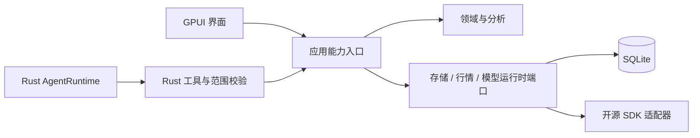

# 统一能力与适配接口

版本 0.3 · 2026-09-26 · 首轮实施契约；类型为设计约定，尚非 SDK。金融口径见 [金融规则](financial-engine.md)，AI 状态见 [上下文管理](context-state-management.md)。

## 1. 单一调用路径



进程内 Rust trait/应用服务为业务入口；跨进程仅在需要处编码 DTO。首版不引入 HTTP 微服务或通用插件总线。MCP 是未来传输适配候选，不定义另一套业务工具。

## 2. 能力目录与公共信封

每项能力声明稳定 `capability_id`、`schema_version`、输入/输出 schema、effect（query/command）、owner、所需范围和取消语义。注册的工具目录从应用能力投影；首版只投影查询白名单，不能把所有 command 自动暴露给模型。

```text
CallContext
  request_id, library_id, actor_kind, run_id?, generation?,
  scope_ref, expected_revision?, deadline, cancellation

ResultEnvelope<T>
  schema_version, request_id, result_id, value,
  scope_snapshot, source_versions, quality,
  missing_inputs[], evidence_refs[], warnings[]

ErrorEnvelope
  schema_version, request_id, code, retryable,
  safe_message, details_allowlist, correlation_id
```

`scope_ref` 由宿主签发并在宿主解析，不让模型提交任意账户集合替代授权。模型与工具回调的 run/generation/request_id 必须匹配活跃实例；generation 是生命周期防陈旧标识，不宣称密码学鉴权。

错误码至少覆盖 `INVALID_ARGUMENT`、`SCOPE_DENIED`、`REVISION_CONFLICT`、`MISSING_INPUT`、`UNSUPPORTED_CAPABILITY`、`PROVIDER_UNAVAILABLE`、`RATE_LIMITED`、`CANCELLED`、`INTERRUPTED`、`PROTOCOL_ERROR`。错误保留是否可重试；不返回秘密或原始响应正文。

金额/数量/费率为十进制字符串；时间为 UTC RFC3339、区间 `[start,end)`；实体 ID 不依赖显示名称。无值与零不同。scope 中始终显式记录本位币/报表币种、成员快照和数据/计算版本。

## 3. 主要端口

| 端口 | 最小契约 | 不允许的旁路 |
| --- | --- | --- |
| LedgerService | 预览、提交、冲销替代、对账、快照与损益 | UI/AI 直接写分录或自行算收益 |
| MarketDataProvider | 能力、标的、日线/公司行动/FX、游标及来源时间 | 用余额或调整行情改写持仓 |
| JournalService | 保存/版本、检索、关联、ChartContext | 无范围查询整个笔记库 |
| ChartAdapter | 加载范围、窗口/指标/标记、选择、导入/导出上下文 | 自行维护指标算法和未来可见性 |
| AgentRuntime | start、prompt、cancel、checkpoint/close、resume、能力检测与事件 | 模型框架直接访问业务库 |
| AnalysisToolGateway | 列白名单、schema 校验、查询与证据回执 | 任意 SQL、shell、文件和真实交易工具 |

ModelClient 负责类型化请求与协议事件，AgentRuntime 负责工具循环和上下文状态；两个端口不混用。具体字段与两协议合同见 [Rust 模型客户端](rust-model-client.md)。

## 4. Rust 模型与 Python 边界

模型接入在 Rust 进程内通过 ModelClient 端口与 Tokio 异步流完成，不另建模型工作进程或公共 HTTP 服务。Responses 与 Chat Completions 适配转换为公共事件，完整工具请求再交 Rust 网关。配置/模型/协议/能力明确绑定 run，错误、取消和迟到结果不得绕过宿主状态机。

事件公共头为 run_id/generation/sequence/type；至少涵盖运行开始、文本增量、完整工具请求/回执、压缩开始/结束、用量、完成、错误、取消。UI 无法接续时从 SQLite checkpoint 重建，不宣称网络流恰好一次。预算、流大小和重试限制以模型客户端合同为正本。

Python 仅在指标/日历/数据连接等有消费者时按 [系统架构](system-architecture.md)使用 stdio JSONL 请求/响应。握手确认协议版本和能力，stdout 仅输出协议，stderr 脱敏诊断；不用 shell 拼接命令。每条记录包含 request_id，必要时带 run/generation；截断 JSON/UTF-8、超大消息、重复响应、背压、超时和子进程退出均需可控失败。模型密钥不发送给指标/策略进程。

## 5. 幂等、取消与兼容

业务 command 用 request_id 与输入摘要绑定，同 ID 不同输入拒绝；回执和变更同事务。query 的重试必须绑定相同快照；业务未实现某旧修订查询时明确拒绝，不能暗换 latest。

取消先设置宿主状态并停止接纳新的工具调用，再取消 Rust 网络/编排任务；期限内未退出标 interrupted 并回收可释放资源。已提交业务不能撤销冒充未发生。晚到事件按 generation 丢弃，已观察的费用保留；没有成功终态的报告不得标成功。

新增可选字段向后兼容；不兼容 schema 主版本升级并有迁移/拒绝路径。数据库 schema、工具 schema、金融计算版本、数据修订和运行代次分开管理。

## 6. 必需契约验证

相同 scope/版本的 UI 查询与 AI 工具数值、质量和证据一致；未知工具、伪造范围、陈旧 generation 和失效引用均被拒绝。覆盖重复请求、并发更正、取消晚到响应、断开恢复、错误映射、金额跨语言无损和协议版本不匹配。首轮场景见路线中的 AC 与后续 R1 用例。
