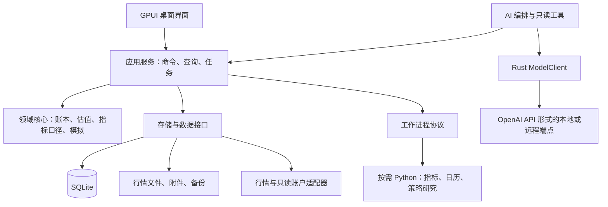

# DELTA 系统架构设计

版本 0.3 · 2026-09-26；公共能力与运行协议详见 [统一接口](integration-contracts.md)，Rust 会话所有权详见 [上下文状态](context-state-management.md)。

## 1. 架构目标与决策

采用本地优先的模块化单体：Rust 桌面进程负责界面、业务命令、账本和任务协调；Rust 自研模型客户端与应用层编排负责 AI，按需启动 Python 指标/研究工作进程。首版不引入服务端、微服务、外部消息队列或插件市场。

领域核心不依赖 GPUI、数据库驱动或模型供应商。图表、训练、回测和 AI 使用相同的业务查询与计算服务，避免重复实现收益口径。

依赖优先级：现成开源实现 → 薄适配层 → 有明确差异化需求的自研。候选和验证条件见 [技术选型](../engineering/technology-selection.md)。

## 2. 逻辑架构



图中为逻辑模块，不要求一开始创建同等数量的 crate。拟议位置见 [仓库地图](../dev-rules/repo-map.md)。AI 工具请求使用 Rust 统一能力入口；ModelClient 不直接读取业务库。Python 仅在本轮确有消费者时创建。

## 3. 模块职责与依赖边界

| 模块 | 负责 | 不负责 |
| --- | --- | --- |
| 桌面视图 | 展示、输入、焦点、面板与图表交互 | SQL、手续费计算、供应商响应解析 |
| 应用服务 | 用例编排、权限范围、事务、任务、缓存失效 | 各市场细节写死在 UI 中 |
| 账本核心 | 事件校验、分录、持仓批次、转账范围、更正 | 网络请求、窗口绘制 |
| 分析核心 | 估值、收益、回撤、统计、证据结果 | 自行猜测缺失汇率或成本 |
| 行情服务 | 标的解析、覆盖、版本、复权与聚合 | 直接调整真实持仓数量 |
| 模拟核心 | 回放时钟、订单、撮合、费用、模拟组合 | 调用真实下单接口 |
| 研究服务 | 策略版本、实验、扫描、Python 协议 | 将任意脚本当作可信沙箱 |
| AI 服务 | 上下文范围、工具调用、引用、报告 | 直接修改数据库或计算损益 |
| 基础设施 | SQLite、文件、网络、凭据和供应商适配 | 定义新的金融口径 |

训练与回测共享一个模拟核心：训练接收用户订单意图，回测接收策略订单意图；双方消费相同的历史数据可见性接口。

## 4. 进程与异步模型

- GPUI 主线程只处理 UI 状态和渲染。数据库查询、CSV 解析、网络和统计不在渲染回调执行。
- Tokio 作为网络和后台任务运行时，通过消息/通道与 GPUI 对接；不在 UI 内嵌套阻塞 `block_on`。
- SQLite 写入由单一写入执行器串行管理；只读连接使用短事务。持仓和报告计算使用捕获的数据版本，避免读取跨版本的半更新状态。
- CPU 密集任务进入有限并发工作池；大批量扫描有内存与并发上限。行情更新合并推送，避免每个 tick 触发整页刷新。
- Python 工作进程按角色启动。持有交易所只读凭据的连接器进程不与用户策略进程复用；策略进程不继承账户凭据。

后台任务持久化 `task_id/kind/state/progress/checkpoint/input_version/error`。状态为 queued → running → succeeded / failed / cancelled；取消请求可先进入 cancelling，UI 明确显示。

应用退出取消可中断任务，并完成正在提交的短事务。启动后把遗留 running 标为 interrupted，只有有明确检查点的任务才能恢复。恢复扫描不能跳过未持久化的结果。

## 5. 应用命令与查询

命令改变状态，例如 `PreviewImport`、`CommitImport`、`CorrectEvent`、`PairTransfer`、`SaveJournal`、`StartTraining`、`RunExperiment`。命令带请求 ID，重复提交能识别。

查询不改变业务数据，例如 `GetPortfolioSnapshot`、`ExplainPnl`、`GetChartContext`、`SearchJournal`、`GetEvidence`。查询必须显式传入组合、时间、币种和数据修订号，或明确使用当前修订号。

命令返回业务对象 ID、修订号和提示；提交后发布本地领域通知供视图刷新。首版用进程内消息即可，不要求外部事件总线。

```text
ImportPreviewRequest
  account_id, file_hash, mapping_version, timezone, decimal_format

ImportCommitRequest
  request_id, preview_id, accepted_row_ids, expected_revision

AnalysisScope
  account_ids, start_at, end_at, reporting_currency,
  ledger_revision, market_dataset_version, calculation_version

AnalysisResult
  result_id, scope, value, quality_status, missing_inputs,
  evidence_ids, generated_at
```

预览绑定文件哈希和映射版本；文件或映射变化后旧预览不可直接提交。查询结果缓存键必须包含范围与版本。

## 6. 数据源接口

数据源按能力声明，不能假设一个 SDK 提供全部功能：

```text
MarketDataProvider
  capabilities()                 # 市场、周期、复权、历史深度、延迟
  resolve_instruments(query)
  fetch_bars(request, cursor)
  fetch_corporate_actions(request)
  fetch_fx_rates(request)

AccountProvider
  capabilities()                 # 成交、流水、余额、时间范围
  fetch_fills(request, cursor)
  fetch_cashflows(request, cursor)
  fetch_balances(as_of)
```

请求包含稳定标的 ID、场所、UTC 时间区间和原市场时区。响应保留原始来源 ID、源时间和拉取时间。连接器负责字段转换与限流；领域核心负责业务校验。

以提供方的限流信息设置退避，鉴权失败不无限重试。分页数据提交成功后才推进游标；保留重叠拉取窗口，通过幂等键处理重传。余额快照只用于核对，不直接覆盖事件账本。

## 7. Python 工作进程

优先使用锁定依赖的独立环境和 stdio JSON-RPC 风格协议。stdout 仅用于协议；日志写 stderr，经脱敏后收集。每个消息包含协议版本、请求 ID、方法、参数，响应包含结果或结构化错误。

金额/数量通过十进制字符串传递。指标数组可使用浮点；小数据先用 JSON，经过测量有瓶颈后才采用 Arrow IPC 或受控文件传递。协议限制消息大小、输出数量、运行时长与并发。

方法可以包括 `compute_indicators`、`scan_conditions`、`run_strategy_step` 和 `cancel`。凭据只发给获准的连接器角色；策略只接收当前时刻可见数据。

独立进程提供崩溃隔离和终止能力，**本身不是安全沙箱**。S3 默认只允许运行用户信任的本地脚本，展示执行能力；接收不可信第三方脚本前需增加操作系统隔离。移除进程环境里的秘密并不能阻止同一 OS 用户脚本访问其已有文件权限。

是否随 S1 发布 Python 取决于指标后端验证。优先尝试复用 TA-Lib；先比较可用 Rust/原生绑定与受控 Python，不先自研指标。只有现成方案有记录的实质缺口，才考虑首批有限 Rust 实现并用 TA-Lib 对照。模型与指标/策略角色和凭据独立。

## 8. 图表边界

为图表定义业务接口：加载时间范围、设置可见窗口、叠加指标/成交/笔记、导出上下文、回放截断、选择时间点。GPUI 或经另行决定的备选图表只负责表现和交互，不能拥有独立的账本与指标口径。

先验证 GPUI Kit 内置 K 线能力。如果关键交互需要大量重写，先比较 Rust 原生替代并集中处理 OSS-01；引入 WebView/额外前端语言需新的明确决定，不在 Rust + Python 基线中默认启用。实现选择不得绕过功能验收。

## 9. 存储、版本与恢复

S1 使用 SQLite 保存业务数据和适度规模的日线行情，减少部署组件。多市场长期行情增长后，按数据接口迁移到不可变 Parquet 分片，SQLite 保留目录、版本和覆盖信息。

推荐资料库结构如下，实际位置由 OS 应用数据目录与用户选择决定：

```text
delta-library/
  manifest.json
  delta.sqlite
  attachments/
  imports/              # 用户选择保留的原文件
  market/               # 后续 Parquet 分片
  experiments/
  backups/
  logs/
```

账本源记录和分录可追溯，派生持仓/收益缓存可重建；不把所有 UI 操作改造成复杂事件溯源系统。

迁移前创建一致性备份。数据库用 SQLite 备份 API/快照机制，不能只复制 WAL 模式下的主文件。备份包含清单、数据库版本、附件和行情清单的内容哈希；行情大文件可选包含，未包含的数据必须列为恢复后待获取。

附件先写临时文件并校验再原子改名，数据库提交引用。失败时保留可清理的孤立文件，不能提交指向尚未写完附件的引用。恢复到新目录并校验后再切换，失败不覆盖当前资料库。

## 10. 凭据、诊断和发布

凭据使用操作系统凭据存储，数据库仅保存引用。默认不开启金融正文遥测。日志记录任务 ID、错误类别、耗时和匿名化来源，不记录密钥/笔记/完整账户号；诊断导出由用户触发并预览内容。

先发布 Windows 安装包/可执行包，验证 GPU、输入法、缩放、Rust 模型网络依赖、Python 可选依赖以及无开发环境的干净机器。macOS/Linux 通过各自构建和验收后再发布。

锁定 Rust 工具链与 Cargo.lock；Python 启用时增加其运行时与锁文件。升级依赖通过相同金融样本、UI 冒烟和打包检查；不能因库发布新版本自动改变计算口径。
